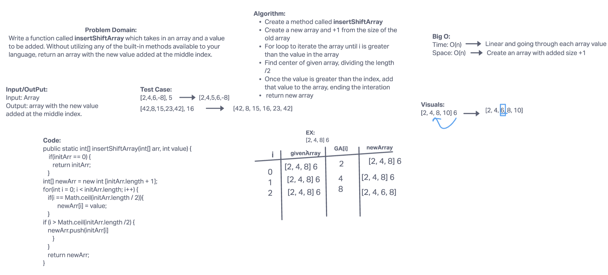

# Data Structures

## Implementation Notes

## Code Challenges

### Challenge 01

Location: `codechallenges/linkedlist/LinkedListChallenges`

Method: `linkedListChallenge06()`

# Code Challenge 2:

# Insert to Middle of an Array
Write a function called insertShiftArray which takes in an array and a value to be added. Without utilizing any of the built-in methods available to your language, return an array with the new value added at the middle index.

## Whiteboard Process
[WhiteBoard]

## Approach & Efficiency
Approach was to set values for the first index and last in the array. If the key value pair was greater compared to the value in the midpoint that it is being tested, to add it infront of the value. Using Time O(n) because it is linear and going through each array value and Space O(n) to reate an array with added size +1.
